

    

        

            

                <H2>Good-Loop VAST/VPAID ad output</H2>
            

            

        

    

    

            

                

                    In the Good-Loop Portal, after you have created a new video ad, you can view the ad either on the Good-Loop demo page or you can copy VPAID/VAST code and use it in Google Ad Manager.
                

            

            

                
            

        

    

    

        

            

        

    

    

        

            You can take your copied Good-Loop VAST/VPAID URL and immediately test it using <a href="https://developers.google.com/interactive-media-ads/docs/sdks/html5/vastinspector" target="_blank">Google's Video Suite Inspector</a>
        

        

            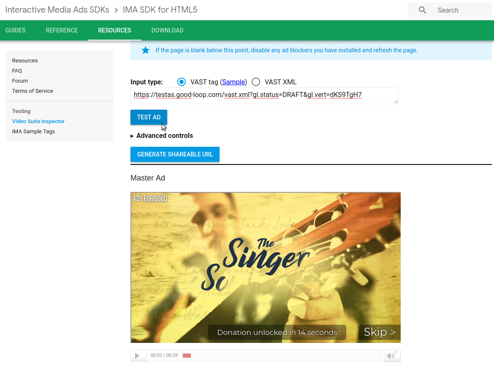
        

    

    

        

            

        

    

    

        

            

                Once you see that your test is working, you can move on to using your Google Ad Manager Account to start processing your Good-Loop VAST/VPAID URL
            

        

    

    

        

            

        

    

    

        

            <H2>Create a new Ad Unit</H2>
        

    

    

        

            Once you've logged into your Google Ad Manager account, click on Inventory->Ad units
             
            Create a new Ad Unit on the current level of your network
        

        

            
        

    

    

        

            

        

    

    

        

            When setting up your new Ad Unit, select a VAST video size of 400x300v
        

        

            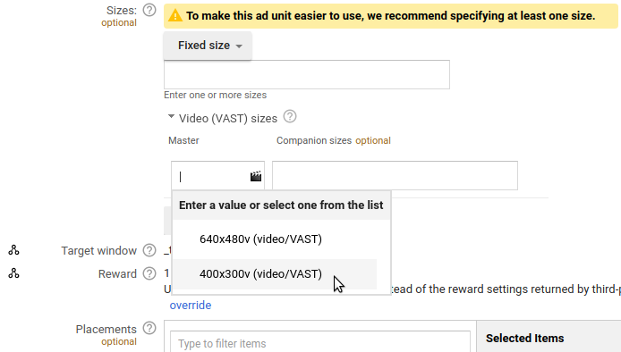
        

    

    

        

            

        

    

    

        

            

                Go ahead and generate a Tag for your new Ad Unit.  Start by clicking on "Generate Tag" on the right-hand side of the screen.
                 
                Generating the correct tag will involve 4 steps:
            

        

    

    

        

            <ul class="list-group">
                

                    <li class="list-group-item">
                        Step 01: 
                    </li>
                    <li class="list-group-item">
                        Step 02: 
                    </li>
                    <li class="list-group-item">
                        Step 03: 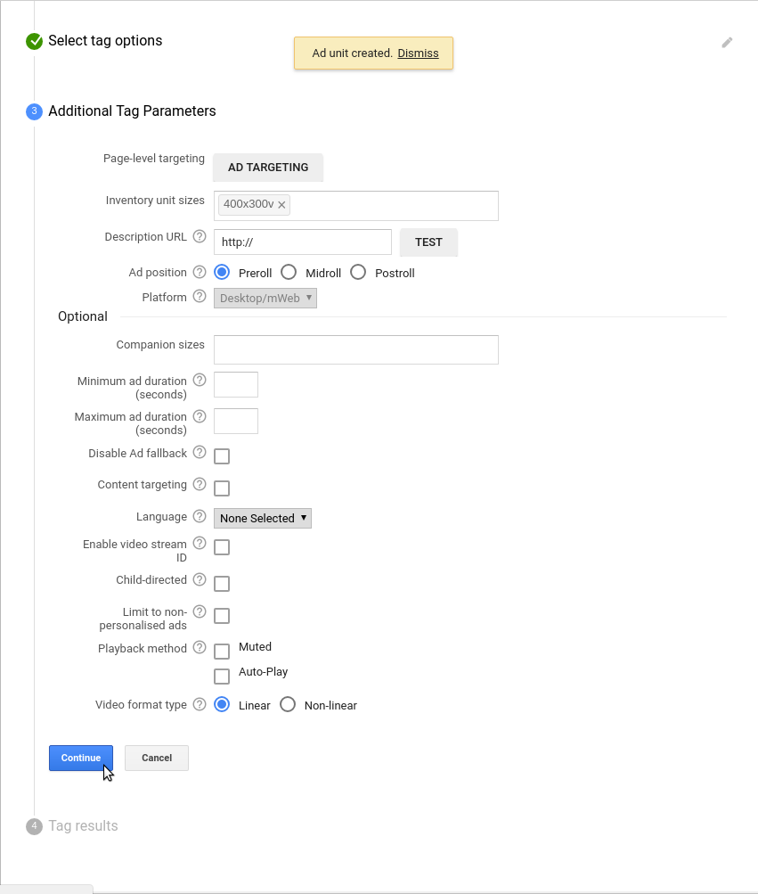
                    </li>
                    <li class="list-group-item">
                        Step 04: Make sure to copy your generated tag and paste it in a text editor of your choice.  Keep this tag safe, we'll need it at the end of this tutorial. 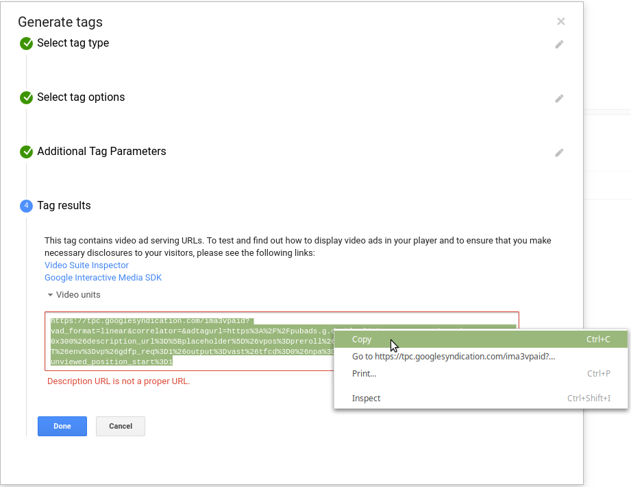
                    </li>
                

            </ul>
        

    

    

        

            

        

    

    

        

            

                <H2>Create a new Line Item and Order</H2>
            

            

        

        

            Click on Delivery->Line Items. And click on the "New Order" button.
        

        

            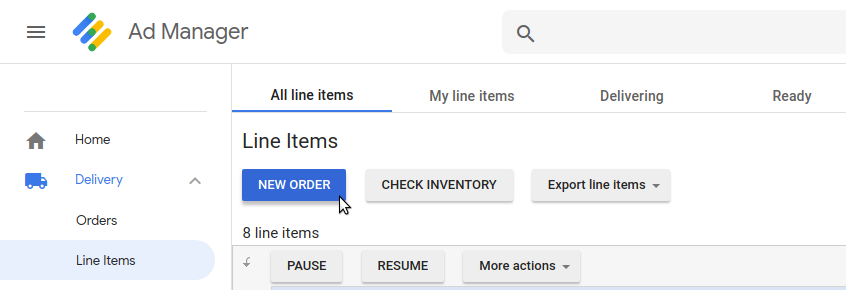
        

    

    

        

            

        

    

    

        

            Give your new order a name, and select an appropriate advertiser. Likewise, give your new line item a name. Select the radio button next to "Video VAST" and put in "400x300v" for a size.
        

        

            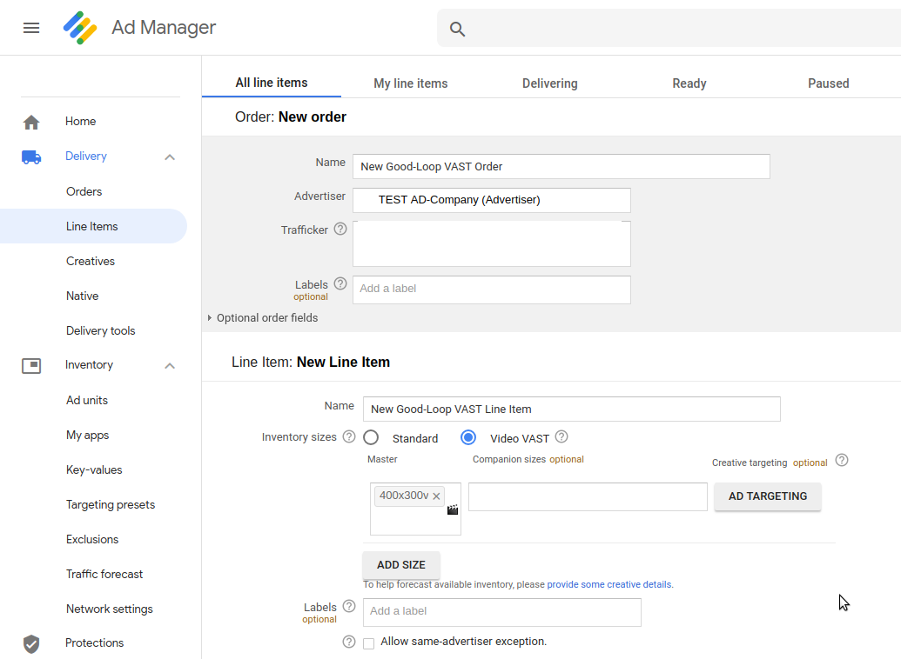
        

    

    

        

            

        

    

    

        

            Scroll down to the "Ad targeting" section, and include the new Ad Unit that you previously created.
             
            You are now ready to click "Save"
        

        

            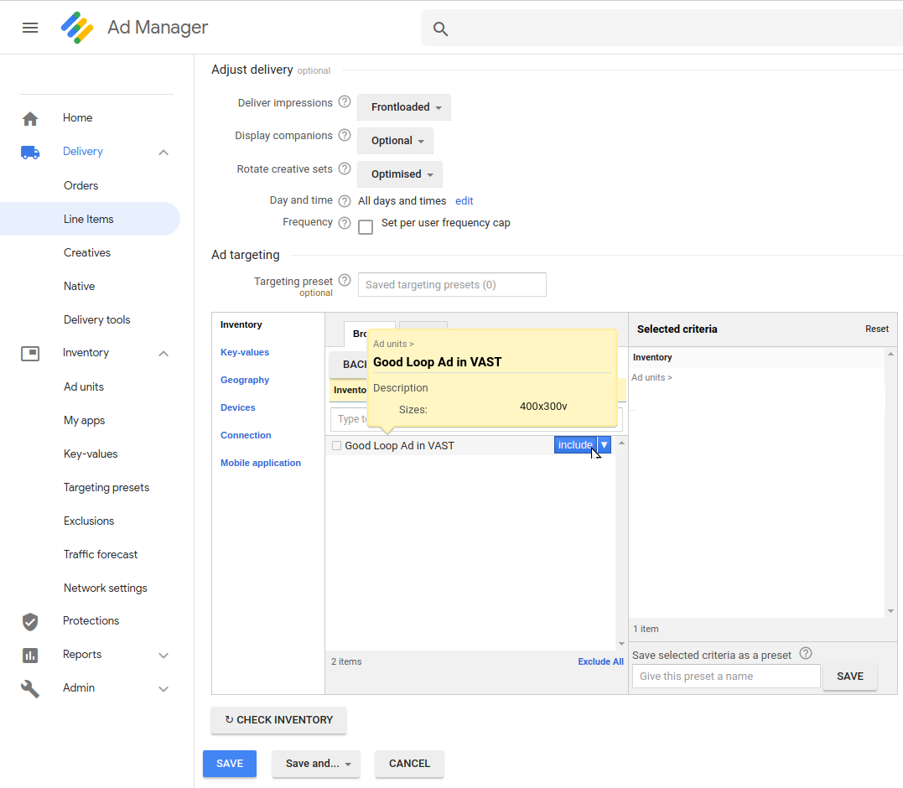
        

    

    

        

            

        

    

    

        

            Now that you've saved your new Line item, you must approve it.
        

        

            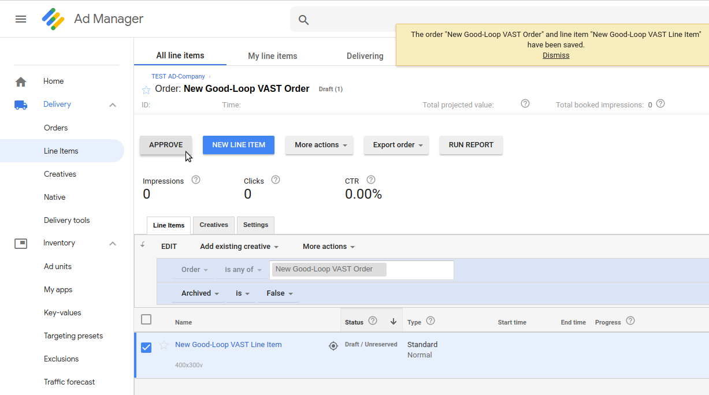
        

    

    

        

            

        

    

    

        

            

                <H2>Create a new "Creative Set"</H2>
            

        

    

    

        

            

        

    

    

        

            Click on Delivery->Creatives, and click on the header tab "Creative sets".  Now click on "New Creative Set".
        

        

            
        

    

    

        

            

        

    

    

        

            Select an appropriate advertiser for your new creative set. Select the "Video VAST" radio button, and put "400x300v" in the size field.
        

        

            
        

    

    

        

            

        

    

    

        

            Give your new Creative Set a name, and click on the "Redirect" type of creative set.
             
            This will expand the rest of the options that are available for this type of creative. You will now want to paste your Good-Loop VAST URL in the "VAST Tag URL" field.
        

        

            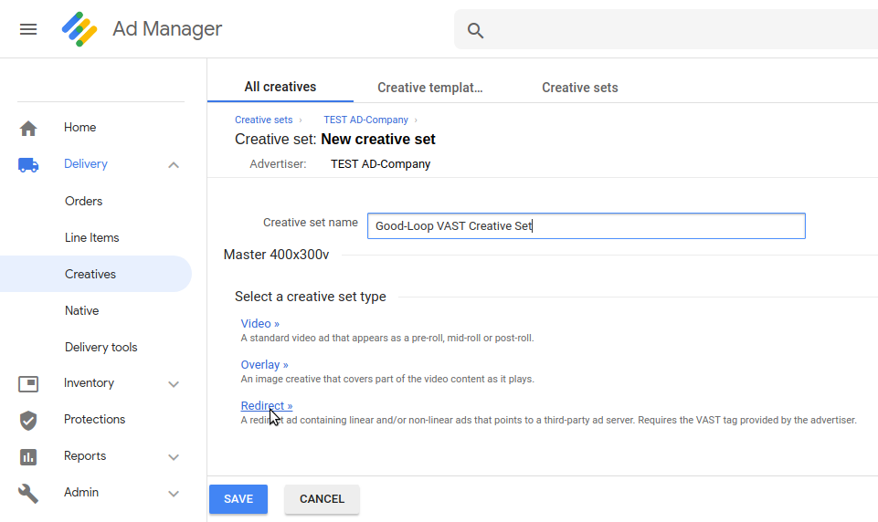
        

    

    

        

            

        

    

    

        

            Go ahead and click on the "TEST" button next to the input field.  This will open a separate browser window that is full of XML (you can close that new window) and Google Ad Manager will also read and discern as much of the VAST URL that you've just given it.
        

        

            
        

    

    

        

            

        

    

    

        

            Go ahead and click "Save"
        

        

            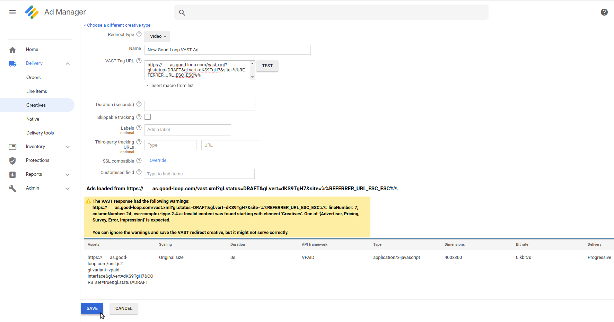
        

    

    

        

            

        

    

    

        

            You will now be able to associate your newly created "Creative", with your Line Item that you made in the last section.
        

        

            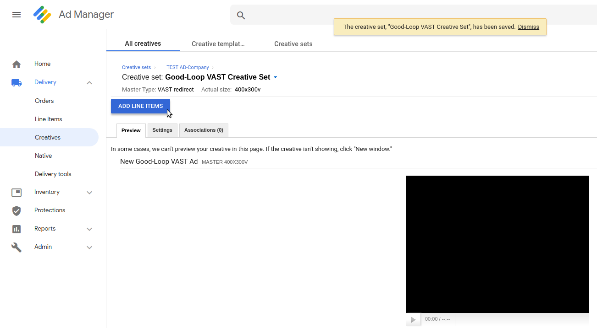
        

    

    

        

            

        

    

    

        

            Add your new "line item" to your new "creative".
        

        

            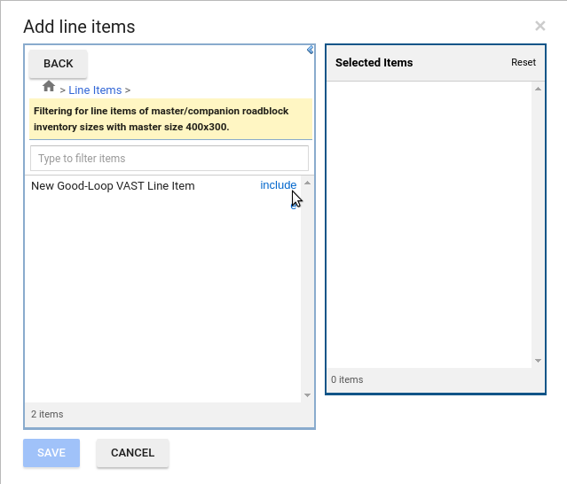
        

    

    

        

            

        

    

    

        

            

                <H2>Wait for it ...</H2>
                Yes, you read that header correctly.  You must wait for Google Ad Manager to actually make your new VAST Tag live. Give it 20-30 minutes before you move on to the next section.
            

        

    

    

        

            

        

    

    

        

            

                <H2>Test it</H2>
            

        

    

    

        

            

        

    

    

        

            Open a new browser tab to <a href="https://developers.google.com/interactive-media-ads/docs/sdks/html5/vastinspector" target="_blank">Google's Video Suite Inspector</a> and get your generated tag [that you made and saved in the first section of this tutorial] ready for use (copy it).
             
            Past your generated tag into the Google Video Suite Inspector and click "Test Ad".  You should see your ad appear in the video player.
        

        

            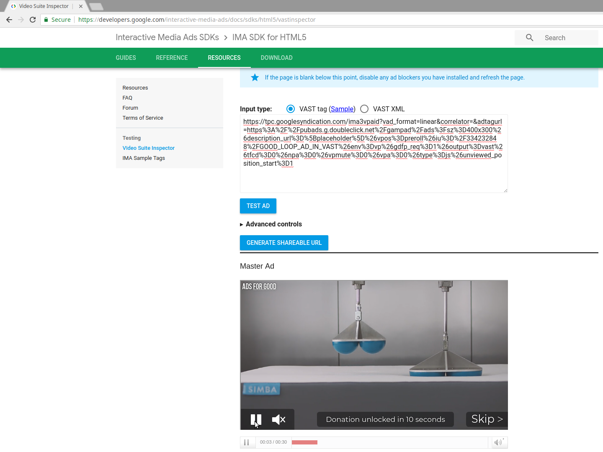
        

    

    

        

            

        

    

    

        

            

                That's it.  You have now successfully told Google's Ad Manager Suite to serve a VAST video which is redirected from the Good-Loop platform.
            

        

    

